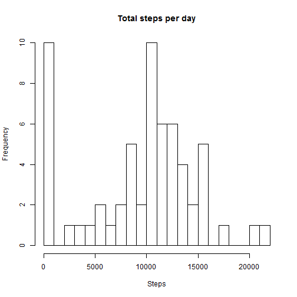
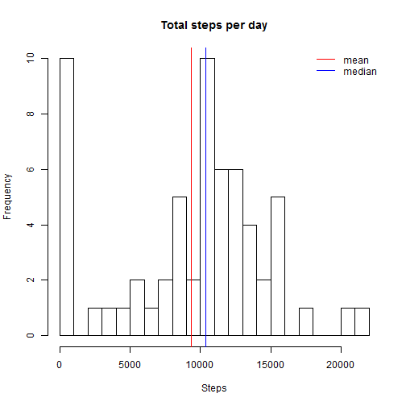
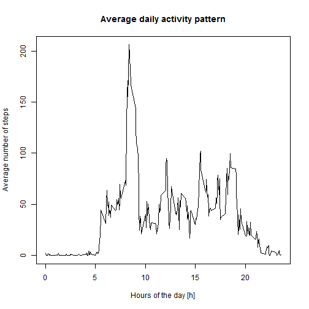
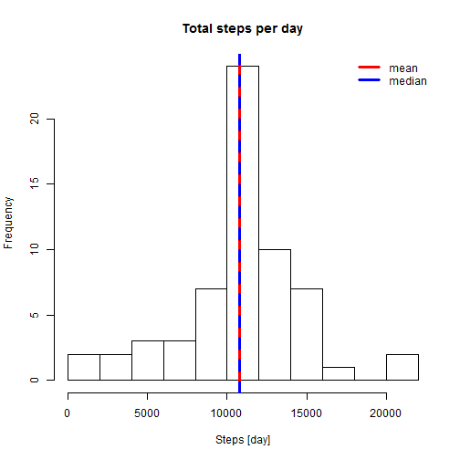
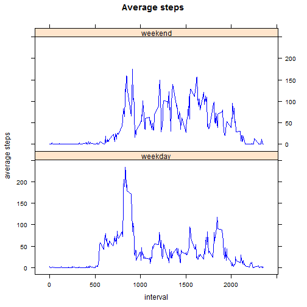

## Reproducible Research - Peer Assessment 1

1.  **Loading and preprocessing the data**

In this step I load the data into a dataframe. I suppose that "activity.csv" file is 
in the same directory of R Markdown file.


```r
act <- read.csv("activity.csv")
str(act)
```

```
## 'data.frame':	17568 obs. of  3 variables:
##  $ steps   : int  NA NA NA NA NA NA NA NA NA NA ...
##  $ date    : Factor w/ 61 levels "2012-10-01","2012-10-02",..: 1 1 1 1 1 1 1 1 1 1 ...
##  $ interval: int  0 5 10 15 20 25 30 35 40 45 ...
```

```r
summary(act)
```

```
##      steps                date          interval     
##  Min.   :  0.00   2012-10-01:  288   Min.   :   0.0  
##  1st Qu.:  0.00   2012-10-02:  288   1st Qu.: 588.8  
##  Median :  0.00   2012-10-03:  288   Median :1177.5  
##  Mean   : 37.38   2012-10-04:  288   Mean   :1177.5  
##  3rd Qu.: 12.00   2012-10-05:  288   3rd Qu.:1766.2  
##  Max.   :806.00   2012-10-06:  288   Max.   :2355.0  
##  NA's   :2304     (Other)   :15840
```
2. **What is mean total number of steps taken per day?**

+ Calculate the total number of steps taken per day

```r
tot_step_by <- tapply(act$steps, act$date, sum, na.rm=T)       
head(tot_step_by)
```

```
## 2012-10-01 2012-10-02 2012-10-03 2012-10-04 2012-10-05 2012-10-06 
##          0        126      11352      12116      13294      15420
```

+ Make a histogram of the total number of steps taken each day

```r
hist(tot_step_by, breaks=25, xlab="Steps", ylab = "Frequency", main="Total steps per day")
```

 

+ Calculate and report the mean and median of the total number of steps taken per day

```r
hist(tot_step_by, breaks=25, xlab="Steps", ylab = "Frequency", main="Total steps per day")
abline(v=mean(tot_step_by), col="red", lwd=1)
abline(v=median(tot_step_by), col="blue", lwd=1)
legend(x="topright", legend=c("mean","median"), col=c("red","blue"), bty="n", lwd=1)
```

 

3. **What is the average daily activity pattern?**

+ Make a time series plot (i.e. type = "l") of the 5-minute interval (x-axis) and the average number of steps taken, averaged across all days (y-axis)

```r
avg_steps <- tapply(act$steps, act$interval, mean, na.rm=T)
hours <- as.numeric(names(avg_steps)) / 100
hours <- ifelse(hours < hours,paste("0",hours,sep=""),hours)
plot(hours, avg_steps, type="l",xlab="Hours of the day [h]", ylab="Average number of steps",main="Average daily activity pattern")
```

 

+ Which 5-minute interval, on average across all the days in the dataset, contains the maximum number of steps?

```r
avg_steps_max <- subset(avg_steps, avg_steps == max(avg_steps))
names(avg_steps_max)
```

```
## [1] "835"
```

4. **Imputing missing values**

+ Calculate and report the total number of missing values in the dataset (i.e. the total number of rows with NAs)


```r
missing_vals <- sum(is.na(act[,1]))
missing_vals
```

```
## [1] 2304
```

+ Devise a strategy for filling in all of the missing values in the dataset. The strategy does not need to be sophisticated. For example, you could use the mean/median for that day, or the mean for that 5-minute interval, etc. and create a new dataset that is equal to the original dataset but with the missing data filled in.


```r
# Replace all the values NA with the average of Steps:
new_act_na <- transform(act, steps=ifelse(is.na(steps), avg_steps, steps))
summary(new_act_na)
```

```
##      steps                date          interval     
##  Min.   :  0.00   2012-10-01:  288   Min.   :   0.0  
##  1st Qu.:  0.00   2012-10-02:  288   1st Qu.: 588.8  
##  Median :  0.00   2012-10-03:  288   Median :1177.5  
##  Mean   : 37.38   2012-10-04:  288   Mean   :1177.5  
##  3rd Qu.: 27.00   2012-10-05:  288   3rd Qu.:1766.2  
##  Max.   :806.00   2012-10-06:  288   Max.   :2355.0  
##                   (Other)   :15840
```

```r
# calculating the sum of the steps by date, median and mean of new dataframe
tot_new_act <- tapply(new_act_na$steps, new_act_na$date, sum, na.rm=T)
# the mean
tot_new_act_mean <- mean(tot_new_act)
tot_new_act_mean
```

```
## [1] 10766.19
```

```r
# the median
tot_new_act_median <- median(tot_new_act)
tot_new_act_median
```

```
## [1] 10766.19
```

+ Make a histogram of the total number of steps taken each day and Calculate and report the mean and median total number of steps taken per day. Do these values differ from the estimates from the first part of the assignment? What is the impact of imputing missing data on the estimates of the total daily number of steps?


```r
hist(tot_new_act, breaks=11, xlab="Steps [day]", main="Total steps per day")
abline(v=tot_new_act_mean, col="red", lwd=3)
abline(v=tot_new_act_median, col="blue", lwd=3, lty=2)
legend(x="topright", legend=c("mean","median"), col=c("red","blue"), bty="n", lwd=3)
```

 

Replacing missing values the peak remains at around 10,000 but the frequency is higher, then it seems that the replacement does lose in accuracy.

5. **Are there differences in activity patterns between weekdays and weekends?**

+ Create a new factor variable in the dataset with two levels - "weekday" and "weekend" indicating whether a given date is a weekday or weekend day.

+ Make a panel plot containing a time series plot (i.e. type = "l") of the 5-minute interval (x-axis) and the average number of steps taken, averaged across all weekday days or weekend days (y-axis). See the README file in the GitHub repository to see an example of what this plot should look like using simulated data.


```r
library(lattice)
act$date<-as.Date(act$date,format = '%Y-%m-%d')
# change local language and find weekend and weekday
Sys.setlocale("LC_TIME", "English")
```

```
## [1] "English_United States.1252"
```

```r
act$day <- ifelse(weekdays(act$date) %in% c("Saturday", "Sunday"),'weekend','weekday')
act_day_type <- aggregate(steps~ interval+day,act,FUN="mean")
xyplot(steps ~ interval | day, act_day_type, layout = c(1, 2), type = "l", col="blue", xlab="interval", ylab="average steps", main="Average steps")
```

 


